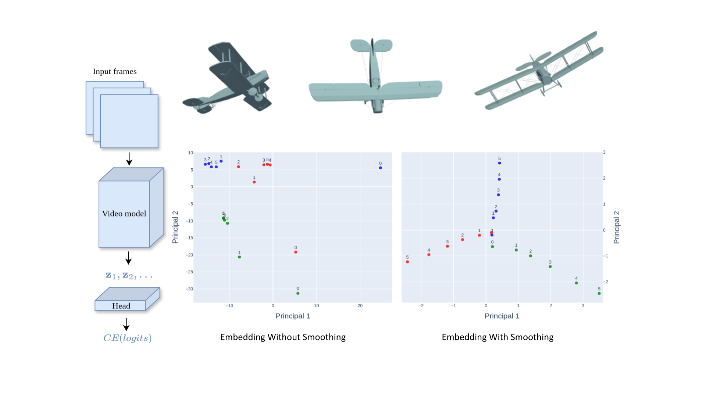
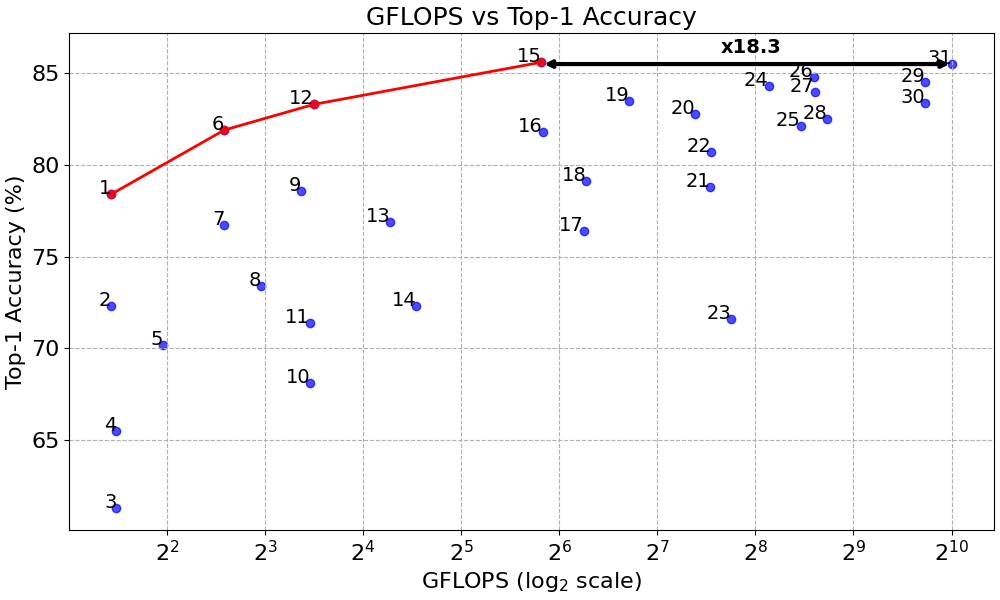

# Smooth Regularization for Efficient Video Recognition (Grw-smoothing)

[Paper (arXiv 2511.20928)](https://arxiv.org/pdf/2511.20928) • [Poster (NeurIPS 2025)](poster-neurips-2025-gil-goldman.pdf) • [Project repo](https://github.com/gilgoldm/grw-smoothing)

GRW-smoothing is a plug-and-play regularization technique for video recognition models that enforces temporal smoothness in intermediate feature embeddings. Consecutive frame embeddings are modeled as a Gaussian Random Walk (GRW), and the training loss penalizes high “acceleration” in this embedding space while preserving the correct frame ordering. This inductive bias suppresses noisy, abrupt representation changes and better aligns the model with the natural temporal coherence of videos, which is especially beneficial for lightweight architectures under tight FLOP and memory budgets. When applied to MoViNet and MobileNetV3 backbones, GRW-smoothing yields improvements of **3.8–6.4 percentage points** on Kinetics‑600 under comparable compute and memory constraints.

---

## Illustration of GRW-smoothing

<p align="center">
  
</p>

**Figure:** Warm‑up airplanes dataset: three classes (yaw, pitch, roll) that are indistinguishable from a single frame. Without GRW‑smoothing, frame embeddings are scattered; with GRW‑smoothing, they form smooth, low‑acceleration trajectories that align with the underlying rotation type.

---

## Results on Kinetics‑600

GRW-smoothing substantially improves the accuracy–efficiency trade‑off of compact video models. On Kinetics‑600, MoViNet‑A0/1/2/3 and their streaming variants, as well as MobileNetV3, achieve **3.8–6.4 pp** higher Top‑1 accuracy compared to previous state of the art at similar GFLOPs or memory usage. In particular, **MoViNet‑A3‑GRW reaches 85.6% Top‑1 at just 56.4 GFLOPs**, while a comparable transformer model (MViTv2‑B‑32×3) needs **18.3× more FLOPs** to match this accuracy.

### GFLOPs vs. Top‑1 Accuracy

<p align="center">
  
</p>

*Figure: Accuracy vs. FLOPs on Kinetics‑600. Red points trace MoViNet variants with GRW‑smoothing; blue points show prior published models (see Table 1). GRW‑smoothing consistently raises the Pareto frontier for efficient video recognition.*

### Table 1 — Kinetics‑600 by FLOPs

Top‑1 accuracy vs. total video evaluation cost (GFLOPs) on Kinetics‑600. Models enhanced with GRW‑smoothing are marked with **GRW**.

| #  | Model                       | Top‑1 (%) | GFLOPs | Res | Frames (clips × frames) |
|----|----------------------------|-----------|--------|-----|--------------------------|
| 1  | **MoViNet‑A0‑S‑GRW**       | 78.4      | 2.7    | 172 | 1 × 50                   |
| 2  | MoViNet‑A0                 | 72.3      | 2.7    | 172 | 1 × 50                   |
| 3  | MobileNetV3‑S              | 61.3      | 2.8    | 224 | 1 × 50                   |
| 4  | MobileNetV3‑S + TSM        | 65.5      | 2.8    | 224 | 1 × 50                   |
| 5  | X3D‑XS                     | 70.2      | 3.9    | 182 | 1 × 20                   |
| 6  | **MoViNet‑A1‑S‑GRW**       | 81.9      | 6.0    | 172 | 1 × 50                   |
| 7  | MoViNet‑A1                 | 76.7      | 6.0    | 172 | 1 × 50                   |
| 8  | X3D‑S                      | 73.4      | 7.8    | 182 | 1 × 40                   |
| 9  | MoViNet‑A2                 | 78.6      | 10.3   | 224 | 1 × 50                   |
| 10 | MobileNetV3‑L              | 68.1      | 11.0   | 224 | 1 × 50                   |
| 11 | MobileNetV3‑L + TSM        | 71.4      | 11.0   | 224 | 1 × 50                   |
| 12 | **MoViNet‑A2‑S‑GRW**       | 83.3      | 11.3   | 224 | 1 × 50                   |
| 13 | X3D‑M                      | 76.9      | 19.4   | 256 | 1 × 50                   |
| 14 | X3D‑XS                     | 72.3      | 23.3   | 182 | 30 × 4                   |
| 15 | **MoViNet‑A3‑GRW**         | 85.6      | 56.4   | 256 | 1 × 120                  |
| 16 | MoViNet‑A3                 | 81.8      | 56.9   | 256 | 1 × 120                  |
| 17 | X3D‑S                      | 76.4      | 76.1   | 182 | 30 × 13                  |
| 18 | X3D‑L                      | 79.1      | 77.5   | 356 | 1 × 50                   |
| 19 | MoViNet‑A4                 | 83.5      | 105    | 290 | 1 × 80                   |
| 20 | UniFormer‑S                | 82.8      | 167    | 224 | 4 × 16                   |
| 21 | X3D‑M                      | 78.8      | 186    | 256 | 30 × 16                  |
| 22 | X3D‑L                      | 80.7      | 187    | 356 | 1 × 120                  |
| 23 | I3D                        | 71.6      | 216    | 224 | 1 × 250                  |
| 24 | MoViNet‑A5                 | 84.3      | 281    | 320 | 1 × 120                  |
| 25 | MViT‑B‑16×4                | 82.1      | 353    | 224 | 5 × 16                   |
| 26 | MoViNet‑A6                 | 84.8      | 386    | 320 | 1 × 120                  |
| 27 | UniFormer‑B                | 84.0      | 389    | 224 | 4 × 16                   |
| 28 | XViT (8×)                  | 82.5      | 425    | 224 | 3 × 8                    |
| 29 | XViT (16×)                 | 84.5      | 850    | 224 | 3 × 16                   |
| 30 | MViT‑B‑32×3                | 83.4      | 850    | 224 | 5 × 32                   |
| 31 | MViTv2‑B‑32×3              | 85.5      | 1030   | 224 | 5 × 32                   |

> **Summary:** Across all FLOP regimes, adding GRW‑smoothing on top of existing backbones consistently yields state‑of‑the‑art accuracy for efficient video recognition.

---

## Inference examples

<!-- TODO: add usage and inference examples -->

---

## How GRW-smoothing is integrated

At a high level, GRW-smoothing can be applied in two ways:

1. **Intermediate-layer smoothing**  
   - Globally pool intermediate feature maps over space.  
   - Normalize them (e.g., using batch norm without learned affine parameters).  
   - Slice the temporal sequence into short clips and apply the GRW loss to these sub‑sequences.

2. **Final-layer smoothing**  
   - Affinely normalize the final per‑frame embeddings.  
   - Apply GRW regularization over short temporal windows.  
   - Optionally feed the smoothed sequence into a lightweight temporal head (e.g., 1–2 layer Transformer) before the classifier.

In both cases, GRW acts purely on embeddings and introduces only a small overhead relative to the backbone, making it easy to drop into existing architectures.

---

## BibTeX

If you use this code or ideas from the paper, please cite:

```bibtex
@article{goldman2025grwsmoothing,
  title   = {Smooth Regularization for Efficient Video Recognition},
  author  = {Gil Goldman and Raja Giryes and Mahadev Satyanarayanan},
  journal = {arXiv preprint arXiv:2511.20928},
  year    = {2025}
}
